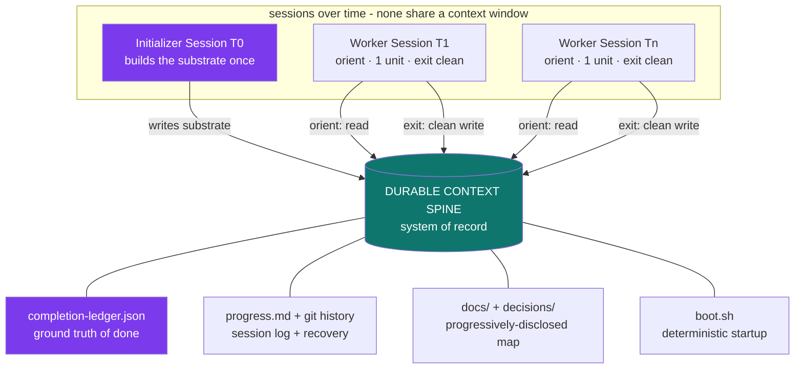

<div align="center">

# Durable Context Spine

**The temporal layer of the Spine. Production patterns for AI agent state, memory, and knowledge that survive the context-window boundary, disconnected sessions, and the passage of time, so the next session (a different agent, weeks later) picks up the thread without loss, re-derivation, or a false sense of "done."**

[](LICENSE-CC-BY-4.0)
[](LICENSE-MIT)
[](SPEC.md)
[](#where-dcs-fits-in-the-stack)

</div>

---

## What this is

DCS is a pattern for the layer that makes a *project*, not a task, survive across many disconnected agent sessions.

Most agent work today happens inside a single context window. The moment a task outgrows that window (a codebase built over weeks, a migration that spans dozens of runs, an operation a single agent picks back up a fortnight later) a different class of failure appears. The agent doesn't fail at *reasoning*. It fails at *continuity*: it declares victory on half-built work, inherits an unintelligible mess from its past self, re-derives from scratch what was already decided, or trusts a stale note that points it the wrong way.

DCS is the discipline that fixes this. Instead of treating the context window as where project knowledge lives, the spine:

- Makes a **durable store the system of record**: if a future session can't read it there, it doesn't exist
- Defines "done" with an **explicit, verification-gated ledger**, never inferred from the artifact
- Requires every session to **exit in a clean, resumable state**
- Splits a one-time **initializer** (build the substrate) from cheap, repeatable **workers**
- Orients every session with a **deterministic startup sequence** before any new work
- Discloses durable knowledge **progressively**: a short map, not a rotting monolith
- Treats **compaction as lossy** and flushes load-bearing state to a durable memory tier first
- Keeps durable state **fresh, provenanced, identity-partitioned, and auditable**

The result: agent projects that advance correctly across days and dozens of sessions, where any session can pick up the thread in seconds and no session declares "done" on work that isn't.

## Why it exists

In late 2025 and early 2026, the teams running agents past the single-window horizon (Anthropic's harness work on Claude Code, OpenAI's Codex harness experiment that shipped ~1M lines with zero hand-written code, the SWE-agent ACI research, the broader "harness engineering" discourse) independently converged on the same conclusion: once a project outgrows one context window, the bottleneck is **continuity of state across the boundary**, and the fix is a durable substrate, not a better prompt.

Four failure modes recur across long-lived agent projects:

1. **False completion.** A fresh session sees code exists, infers the job is done, and stops, declaring victory on a half-built project. Completeness was inferred from the artifact, not read from a ledger.
2. **Inherited mess.** A session runs out of window mid-task and leaves no clean state. The next session burns its budget on archaeology.
3. **Re-derivation tax.** Every session re-discovers how to boot, where things live, and what was decided, because no durable orientation substrate exists.
4. **Durable-state rot.** A stale or monolithic memory artifact actively misleads. The summary survived compaction; the load-bearing nuance didn't.

DCS is the implementation discipline that addresses all four.

## Architecture



The context window is scratch. The durable store is truth. Every session assumes nothing about another session's window survived, because nothing did.

## Where DCS fits in the stack

The Spine catalog names eight separable architectural concerns. PDS, ACS, ESF, CRI, and AGS sit on the *capability* axes: which tools, which agents, which external signals, which risk score, which governance. Three layers sit beneath them as *foundations* the capability layers depend on: **DCS is the *temporal* substrate (which state survives across time), GDS is the *grounding* substrate (which canonical, entitled data the agents reason over), and ARS is the *inventory* substrate (which agentic assets exist at all).** DCS is the substrate the capability layers read from and write to across runs. (GDS, the Grounded Data Spine, and ARS, the Agent Registry Spine, are private/forthcoming siblings, named here as foundations alongside DCS.)

```
        ┌──────────────────────────────────────────────────┐
        │ User · Product · Long-lived Project (days/weeks) │
        └───────────────────────┬──────────────────────────┘
                                ↓
   ┌──────────────────────────────────────────────────────────┐
   │ ACS - coordinate many agents within a run (concurrency)  │
   │ PDS - scope one agent's tools per task                   │
   │ ESF - fuse external-world signals · CRI - risk score     │
   │ AGS - deterministic governance · identity · audit        │
   └───────────────────────┬──────────────────────────────────┘
                           ↓ rest on the foundation substrates
   ┌──────────────────────────────────────────────────────────┐
   │ DURABLE CONTEXT SPINE (DCS) - THIS spec - temporal       │
   │ system of record · ledger of done · clean-state exits ·  │
   │ initializer/worker · progressive knowledge · memory      │
   │ hierarchy · freshness · identity-partitioned · auditable │
   ├──────────────────────────────────────────────────────────┤
   │ GDS - grounding substrate (canonical model · entitled)   │
   │ ARS - inventory substrate (system of record for agents)  │
   │ (private/forthcoming siblings)                           │
   └──────────────────────────────────────────────────────────┘
```

ACS coordinates the agents *inside* a run and persists its handoffs into the DCS store. PDS scopes each agent's tools. DCS is the layer whose job is what survives *between* runs; GDS and ARS are the grounding and inventory foundations the whole stack rests on. Each can be used alone; they were designed to compose.

## The 10 principles

| # | Principle | The shift |
|---|---|---|
| 01 | **The durable store is the system of record; context is disposable** | If a future session can't read it from the store, it doesn't exist. The window is scratch. |
| 02 | **Ground-truth-of-done is an explicit, inviolable ledger** | A verification-gated `passes` flag, never inferred from the artifact. JSON so agents don't casually rewrite it. |
| 03 | **Every session ends in a clean, resumable state** | Commit, update progress, no half-applied edits. "Clean" means mergeable. Version control is the recovery mechanism. |
| 04 | **Separate the initializer from the workers** | A one-time first session builds the substrate; every later session is cheap to start. |
| 05 | **A deterministic startup sequence orients before new work** | Read progress → read ledger → boot → verify baseline → fix breakage first. Then work. |
| 06 | **Progressive disclosure of durable knowledge** | A short stable map pointing to indexed docs, not a monolith that crowds context and rots. |
| 07 | **Compaction is lossy, persist load-bearing state first** | Flush to the working/episodic/semantic hierarchy before the window closes. Don't trust the summary. |
| 08 | **Provenance and freshness, or it rots into a liability** | Stale durable state confidently misleads. Timestamp, version, and run cleanup sweeps. |
| 09 | **Identity-partitioned, no cross-context bleed** | Memory is scoped per project / tenant / agent. Composes with AGS identity. |
| 10 | **The continuity record is the audit surface** | Persisted-with-provenance state reconstructs "what did the session know, and when." Composes with AGS audit. |

Full discussion of each principle (problem, pattern, implementation, anti-pattern) lives in [SPEC.md](SPEC.md).

## Industry context: convergence on the same pattern

DCS is not a novel invention. It's a formalization of a pattern the teams running agents past the single-window horizon have independently converged on.

- **OpenAI, Harness Engineering.** The Codex harness experiment shipped ~1M lines of code with zero hand-written source across five months, on the principle that the repository is the system of record: *from an agent's perspective, anything it cannot access in context while running effectively does not exist.* A ~100-line `AGENTS.md` map points to a structured `docs/` system of record; recurring cleanup tasks fight drift. [Source](https://openai.com/index/harness-engineering/)
- **Anthropic, Harness Design for Long-Running Application Development.** Documents the initializer + coding-agent split, the `feature_list.json` completion ledger (stored as JSON specifically because models are less likely to overwrite it), the progress file, git-as-recovery, and the per-session startup sequence, the response to "the agent had no persistent, structured understanding that could survive the context-window boundary." [Source](https://www.anthropic.com/engineering/harness-design-long-running-apps)
- **SWE-agent (Princeton).** The Agent-Computer Interface work showed context management (collapsing stale observations into single-line summaries, capping tool output) is load-bearing, not cosmetic, for keeping a long session coherent. [arXiv:2405.15793](https://arxiv.org/abs/2405.15793)
- **MemGPT / Letta.** Formalized the working / episodic / semantic memory hierarchy and deliberate paging, the model as an OS managing a small fast tier against durable stores. [arXiv:2310.08560](https://arxiv.org/abs/2310.08560) · [Letta](https://docs.letta.com/guides/agents/memory/)
- **The Awesome Agent Harness taxonomy** separates *frameworks* (what you build on) from *runtimes* (what keeps running: persistent memory, scheduled execution, multi-session coordination). DCS is the spec for that runtime-persistence layer.
- **AWS, Bedrock AgentCore Memory.** AgentCore Memory provides managed short-term (turn-by-turn within a session) and long-term memory (asynchronously extracted semantic facts, summaries, and user preferences across sessions, via swappable Semantic, Summary, User Preference, and Custom strategies), plus episodic memory that records structured episodes of context, reasoning, action, and outcome so agents learn from experience. The closest major-vendor peer to the durable-state-and-memory-across-sessions concern DCS describes (episodic added re:Invent 2025). [Source](https://aws.amazon.com/blogs/machine-learning/amazon-bedrock-agentcore-memory-building-context-aware-agents/)
- **Palantir, Foundry AIP (partial).** AIP Threads, saved chats, and Ontology-Backed Objects persist some conversational and operational state across sessions. A partial convergence only: it persists chat and object state but does not name the durable-system-of-record, completion-ledger, clean-state-exit, and freshness disciplines DCS describes. Recorded as a weak/partial citation. [Source](https://www.palantir.com/docs/foundry/aip/overview)

### What DCS contributes

The sources above document individual implementations. DCS contributes a unified set of **10 principles** mapped to four documented failure modes, **target SLAs** for production continuity, an **8-step build sequence**, **anti-patterns**, and **explicit composition with the rest of the Spine**, so "bad continuity / lost-or-stale durable state" becomes a nameable, attributable architectural concern rather than a class of incidents teams rediscover one painful session at a time. In the catalog's nine-way failure-attribution model, that surface is "bad continuity," attributed to DCS.

## What good looks like (target SLAs)

| Metric | Target | Why it matters |
|---|---|---|
| Cold-start orientation cost (orient → first new action) | < 5% of session budget | Sessions should spend budget on work, not archaeology |
| False-completion incidents | 0 | The ledger defines done, not inference |
| Resumability (sessions starting without manual untangling) | 100% | Clean-state exit is the contract |
| Load-bearing state lost across a compaction event | 0 | If compaction breaks continuity, the discipline is wrong |
| Durable artifacts past their freshness SLA | trended to 0 | Stale state is a defect, not debt |
| Cross-partition memory-bleed incidents | 0 | Memory is identity-scoped |
| Reconstructable "what did the session know, and when" | 100% | Continuity doubles as audit |

## Who this is for

- **Agent platform teams** building anything that outlives a single context window: long codebases, migrations, multi-day operations
- **AI product teams** whose agents "declare victory early," "lose the thread after a break," or "re-derive everything each run"
- **Framework and runtime builders** (Claude Agent SDK, Letta, LangGraph, Codex-style harnesses): the cross-framework vocabulary for durable state
- **Enterprise architects** who need agent memory that survives a tenancy and audit review
- **Anyone composing the Spine**: DCS is the substrate ACS, PDS, and AGS share across time

## What this is not

- Not a library you install. It's an architectural pattern with reference SLAs and examples.
- Not a replacement for any framework. Claude Agent SDK / Letta / LangGraph / Codex harness all *implement* it.
- Not ACS. ACS coordinates agents *within* a run (concurrency); DCS persists state *across* runs (time). They compose. ACS writes its handoffs into the DCS store.
- Not PDS. PDS scopes tools per task; DCS scopes durable knowledge per session. Same progressive-disclosure economics, different axis.

## Use it with Claude (or any AI coding agent)

DCS ships with a [Claude Code skill](dist/skills/dcs/SKILL.md) that turns the spec into an active architectural consultant inside your AI coding session. Install:

```bash
mkdir -p ~/.claude/skills/dcs
cp dist/skills/dcs/SKILL.md ~/.claude/skills/dcs/SKILL.md
```

After install, the skill auto-activates whenever you ask about agent memory, long-lived projects across sessions, "the agent declared it was done but it wasn't," context that doesn't survive between runs, `AGENTS.md` / system-of-record design, or compaction and memory hierarchies. It diagnoses which of the four continuity failure modes you're hitting and recommends which principles to apply.

## Examples

The [`examples/`](examples/) directory has concrete artifacts:

- [`completion-ledger.example.json`](examples/completion-ledger.example.json): the inviolable, verification-gated ledger of "done"
- [`startup-sequence.md`](examples/startup-sequence.md): the deterministic per-session orientation sequence
- [`agents-map.md`](examples/agents-map.md): a short progressive-disclosure root map pointing to deeper docs

## Citing this work

If you reference DCS in a paper, talk, blog post, or vendor architecture, please cite it. A machine-readable citation file is in [CITATION.cff](CITATION.cff). Suggested citation:

> Mattie, D. (2026). *Durable Context Spine: An architectural pattern for agent state and memory that survives across sessions and time.* https://github.com/drewmattie-code/Durable-Context-Spine

## Contributing

Issues, examples, and implementation reports welcome. See [CONTRIBUTING.md](CONTRIBUTING.md).

## License

- **Spec, documentation, diagrams**: [Creative Commons Attribution 4.0 (CC BY 4.0)](LICENSE-CC-BY-4.0).
- **Code samples and examples**: [MIT](LICENSE-MIT).

See [LICENSE](LICENSE) for the summary.

## Catalog

DCS is the temporal layer of an eight-spec Spine catalog:

- **[PDS](https://github.com/drewmattie-code/Progressive-Discovery-Spine)** (public): tool discovery, scoping one agent's tools per task.
- **[ACS](https://github.com/drewmattie-code/Adversarial-Coordination-Spine)** (public): multi-agent coordination within a run.
- **[ESF](https://github.com/drewmattie-code/External-Signal-Fabric)** (public): external-world signals (markets, logistics, geopolitics, supplier health).
- **CRI** (private, patent-preservation): composite risk scoring.
- **[AGS](https://github.com/drewmattie-code/Agent-Governance-Spine)** (public): deterministic governance, identity, and audit.
- **DCS** (public, this spec): durable state and memory across sessions and time.
- **GDS** (private/forthcoming): Grounded Data Spine, the grounding substrate (a canonical semantic model plus data-level entitlements).
- **ARS** (private/forthcoming): Agent Registry Spine, the inventory substrate (one system of record for every agentic asset that discovery reads from and governance enforces against).

PDS, ACS, ESF, CRI, and AGS are the capability layers. DCS, GDS, and ARS are the foundation substrates beneath them: DCS persists what survives across runs, GDS grounds what the agents reason over, and ARS records which agentic assets exist at all.

## Author

[Drew Mattie](https://www.linkedin.com/in/drew-mattie-88084826/) · SaaSquach AI Labs (a division of Charles & Roe Inc.) · 2026
